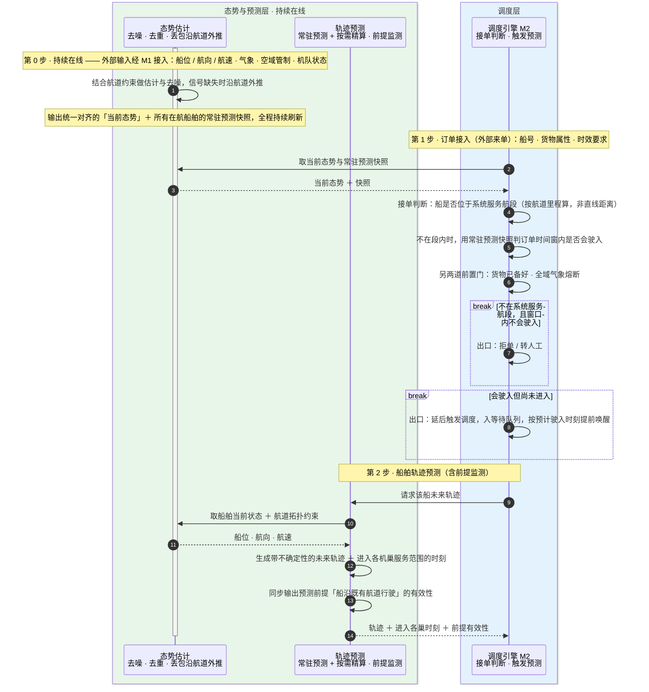

# 91-3 接单预测

> 口径说明：本文是图，属于辅助视图；**与正文表述冲突时一律以正文为准**。
> 图集索引见 [91-时序图](91-时序图.md)。
> 对应正文：[21-主流程设计](../../20-总体设计/21-主流程设计.md) §2、§3。

## 1 第 0–2 步：态势在线、接单判断、轨迹预测

```mermaid
sequenceDiagram
    autonumber

    box rgb(232,245,233) 态势与预测层 · 持续在线
    participant SE as 态势估计<br/>去噪 · 去重 · 丢包沿航道外推
    participant TP as 轨迹预测<br/>常驻预测 + 按需精算 · 前提监测
    end

    box rgb(227,242,253) 调度层
    participant DP as 调度引擎 M2<br/>接单判断 · 触发预测
    end

    activate SE
    Note over SE: 第 0 步 · 持续在线 —— 外部输入经 M1 接入：船位 / 航向 / 航速 · 气象 · 空域管制 · 机队状态
    SE ->> SE: 结合航道约束做估计与去噪，信号缺失时沿航道外推
    Note over SE: 输出统一对齐的「当前态势」＋ 所有在航船舶的常驻预测快照，全程持续刷新

    Note over DP: 第 1 步 · 订单接入（外部来单）：船号 · 货物属性 · 时效要求
    DP ->> SE: 取当前态势与常驻预测快照
    SE -->> DP: 当前态势 ＋ 快照
    DP ->> DP: 接单判断：船是否位于系统服务航段（按航道里程算，非直线距离）
    DP ->> DP: 不在段内时，用常驻预测快照判订单时间窗内是否会驶入
    DP ->> DP: 另两道前置门：货物已备好 · 全域气象熔断
    break 不在系统服务航段，且窗口内不会驶入
        DP ->> DP: 出口：拒单 / 转人工
    end
    break 会驶入但尚未进入
        DP ->> DP: 出口：延后触发调度，入等待队列，按预计驶入时刻提前唤醒
    end

    Note over DP,TP: 第 2 步 · 船舶轨迹预测（含前提监测）
    DP ->> TP: 请求该船未来轨迹
    TP ->> SE: 取船舶当前状态 ＋ 航道拓扑约束
    SE -->> TP: 船位 · 航向 · 航速
    TP ->> TP: 生成带不确定性的未来轨迹 ＋ 进入各机巢服务范围的时刻
    TP ->> TP: 同步输出预测前提「船沿既有航道行驶」的有效性
    TP -->> DP: 轨迹 ＋ 进入各巢时刻 ＋ 前提有效性
    deactivate SE
```
